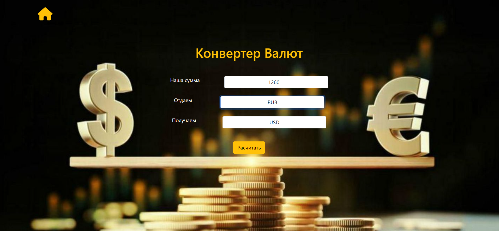
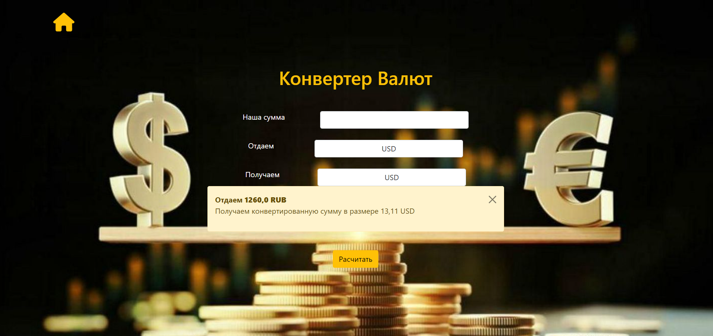

# Конвертер валют

### Результат

## Stack
* Python 3.11
* Django 4.2.5
* DRF

>Также программа предоставляет API для расчета валюты. 
> Пример HTTP GET: http://127.0.0.1:8000/api/rates/?from=USD&to=RUB&value=126 
и возвращает
{
    "result": 12098.29
}